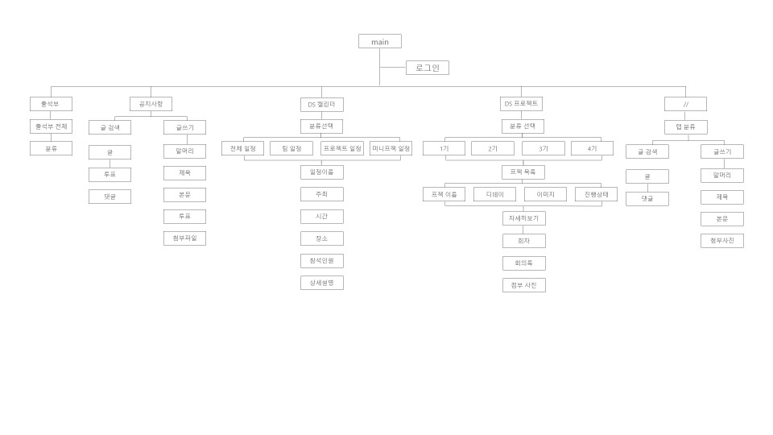

# 4th-miniproject-mobile

기능 정의
   - 공지사항 (가옥)
     - 글 검색
     - 글 쓰기
       - 제목
       - 본문
       - 투표
       - 첨부파일
     - 글 열람
       - 글
       - 투표
       - 댓글
   
   - 탭 분류 (지은)
     - 글 검색
       - 글
       - 댓글
     - 글 쓰기
       - 말머리
       - 제목
       - 본문
       - 첨부사진
